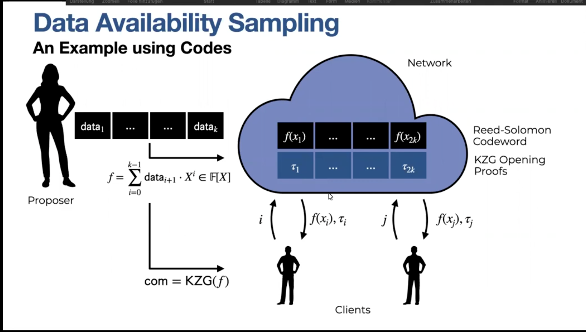

##  Data Availability Sampling
Data availability sampling (DAS) is a technique that allows nodes to verify the availability of data without downloading the entire data. The motivation for DAS is to reduce the bandwidth and storage requirements for nodes, especially for large-scale or high-throughput systems, such as blockchains or rollups.

Erasure coding is a method that splits the data into smaller chunks and adds some redundancy, so that the original data can be recovered from a subset of the chunks. Reed-Solomon code is a type of erasure code that uses polynomials to generate the chunks. KZG commitment scheme is a cryptographic primitive that allows a prover to commit to a polynomial and later reveal any evaluation of the polynomial in a succinct and verifiable way.

- The proposer who produces the data block uses Reed-Solomon code to encode the data into N chunks, where only M < N chunks are needed to reconstruct the data. The proposer also uses KZG commitment scheme to commit to the polynomial that generates the chunks, and publishes the commitment on a bulletin board along with the data availability root (DAR), which is a Merkle root of the chunks.

- The network nodes who download the data block store the chunks that they receive, and use the DAR to verify that the chunks are consistent. They also use the KZG commitment to verify that the chunks are generated by the same polynomial. The network nodes act as data providers who can respond to data requests from clients.

- The clients who want to check the data availability use a random oracle to sample a small fraction of the chunks, and request them from the network nodes. They use the DAR to verify that the chunks are consistent, and use the KZG commitment to verify that the chunks are generated by the same polynomial. If the sampled chunks match the information on the bulletin board, the clients can be confident that the data is available with high probability. If the sampled chunks are inconsistent or missing, the clients can reject the availability claim and penalize the proposer.

The advantage of using KZG commitments over hashes of the data is that KZG commitments allow for more efficient and secure verification of the chunks, as they only require one group element per polynomial, and they are hiding and binding, meaning that the proposer cannot change the polynomial after committing to it.